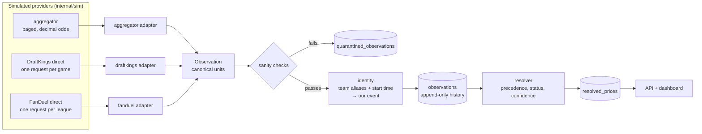

# From provider data to our schema

This page follows one game through the system: how the three simulated
providers describe it, how each description becomes our canonical records,
and how those records change over time. Every payload and database row below
was captured from a real run of `go run ./cmd/dataflow`.

## The pipeline



Everything left of `Observation` is specific to one provider and lives in that
provider's adapter (`internal/provider/<name>`). Everything to the right is
shared code that never checks which provider sent the data.

## How the three providers differ

| | Aggregator | DraftKings direct | FanDuel direct |
|---|---|---|---|
| Request | `GET /v1/odds?sport=basketball_nba&page=N` | `GET /api/events` then `GET /api/events/{id}/offers` | `GET /sportsbook/v1/leagues/nba/events` |
| Poll slice | one per league, walking every page | one per game | one per league |
| Covers | both books | DraftKings only | FanDuel only |
| Event ID | `agg-1001` | `dk-5501` | `fd-9001` |
| Team names | `Los Angeles Lakers` | `LA Lakers` | `Lakers` |
| Start time | RFC 3339 `commence_time` | RFC 3339 `startDate` | epoch seconds `startTime` |
| Price | decimal number, 2 places: `3.95` | American string: `"+295"` | American integer: `282` |
| Side | outcome named by team | `role: "home"` | `side: "HOME"` |
| Timestamp | `last_update` per bookmaker | `updatedAt` per offer | **none** |
| Off the board | market or outcome **left out** | `status: "SUSPENDED"` on the whole offer | `status: "SUSPENDED"` per side |
| Typical problems | lags behind, rate limits, rounds prices | 500s, outages, slow responses, old quotes re-sent, duplicate outcomes | missing prices, no timestamps |

## One game, three schemas

The same moment in the same game, Celtics @ Lakers, as each provider sent it
(trimmed to this game):

**Aggregator** reports both books in one payload, as 2-decimal odds:

```json
{
  "id": "agg-1001",
  "sport": "basketball_nba",
  "commence_time": "2026-09-29T23:00:00Z",
  "home_team": "Los Angeles Lakers",
  "away_team": "Boston Celtics",
  "bookmakers": [
    { "key": "DraftKings", "last_update": "2026-09-29T13:56:19.685Z",
      "markets": [{ "key": "h2h", "outcomes": [
        { "name": "Los Angeles Lakers", "price": 3.95 },
        { "name": "Boston Celtics",     "price": 1.26 } ] }] },
    { "key": "FanDuel", "last_update": "2026-09-29T13:56:37.685Z",
      "markets": [{ "key": "h2h", "outcomes": [
        { "name": "Los Angeles Lakers", "price": 3.82 },
        { "name": "Boston Celtics",     "price": 1.28 } ] }] }
  ]
}
```

**DraftKings direct** reports its own book, in American odds as strings:

```json
{
  "event": { "eventId": "dk-5501", "league": "NBA",
             "homeTeam": "LA Lakers", "awayTeam": "BOS Celtics",
             "startDate": "2026-09-29T23:00:00Z" },
  "offers": [{ "type": "MONEYLINE", "status": "OPEN",
               "updatedAt": "2026-09-29T13:56:19.685Z",
               "outcomes": [
                 { "participant": "LA Lakers",   "role": "home", "oddsAmerican": "+295" },
                 { "participant": "BOS Celtics", "role": "away", "oddsAmerican": "-380" } ] }]
}
```

**FanDuel direct** reports its own book, in American odds as integers, with no timestamp:

```json
{
  "id": "fd-9001",
  "startTime": 1790722800,
  "homeTeam": { "nickname": "Lakers" },
  "awayTeam": { "nickname": "Celtics" },
  "markets": [{ "marketType": "MONEYLINE", "runners": [
    { "side": "HOME", "status": "ACTIVE", "americanOdds": 282 },
    { "side": "AWAY", "status": "ACTIVE", "americanOdds": -362 } ] }]
}
```

## What each field becomes

Each adapter maps its own fields into one `canonical.Observation`
(`internal/canonical/canonical.go`):

| Canonical field | Aggregator | DraftKings | FanDuel | Rule |
|---|---|---|---|---|
| `Source` | `aggregator` | `draftkings_direct` | `fanduel_direct` | fixed per adapter |
| `Book` | `bookmakers[].key` → `draftkings` / `fanduel` | always `draftkings` | always `fanduel` | an unknown bookmaker is quarantined |
| `Event` (provider's view) | `id`, `home_team`, `away_team`, `commence_time` | `event.*` | `id`, nicknames, `startTime` → UTC | matched to our event in the identity step |
| `Market` | `key: "h2h"` | `type: "MONEYLINE"` | `marketType: "MONEYLINE"` | `moneyline` |
| `Side` | outcome `name` compared with home and away team | `role` | `side` | an outcome matching neither team is quarantined |
| `Status` | `open`; left-out markets are inferred later | `SUSPENDED` → `off_board` | per-side `SUSPENDED` → `off_board` | off the board keeps the last price |
| `Price` | decimal as sent | American → full-precision decimal | American → full-precision decimal | a missing or impossible price is quarantined |
| `RawPrice`, `RawFormat` | `"3.95"`, `decimal` | `"+295"`, `american` | `"282"`, `american` | kept for audit |
| `ObservedAt` | `last_update` | `updatedAt` | the time we received it | `HasSourceTimestamp` is false for FanDuel |

Then the **identity step** maps the provider's event onto ours. Each provider
spells the teams differently, and `fixtures/team_aliases.csv` turns every
spelling into one team ID. Teams plus a start time within ±30 minutes find the
game. The first time a provider's event ID is seen it's linked; after that the
link is reused:

| Provider event | Home / away as sent | Team IDs | Our event |
|---|---|---|---|
| `agg-1001` | `Los Angeles Lakers` / `Boston Celtics` | `nba-lal` / `nba-bos` | **1** |
| `dk-5501` | `LA Lakers` / `BOS Celtics` | `nba-lal` / `nba-bos` | **1** |
| `fd-9001` | `Lakers` / `Celtics` | `nba-lal` / `nba-bos` | **1** |

## The canonical result

Those three payloads become six observations for event 1. The resolver then
serves one price per book and side, preferring each book's direct feed while
it's fresh:

| Book | Side | Source | Raw | Stored decimal | Shown as | Served? |
|---|---|---|---|---|---|---|
| DraftKings | home (Lakers) | draftkings_direct | `+295` | 3.95 | +295 | **yes**, `verified`: the aggregator matches at 2 decimals |
| DraftKings | home (Lakers) | aggregator | `3.95` | 3.95 | +295 | used for comparison |
| DraftKings | away (Celtics) | draftkings_direct | `-380` | 1.263158 | −380 | **yes**, `verified`: `1.263158` rounds to the aggregator's `1.26` |
| DraftKings | away (Celtics) | aggregator | `1.26` | 1.26 | **−385** | used for comparison; 2-decimal rounding turns −380 into −385 |
| FanDuel | home (Lakers) | fanduel_direct | `282` | 3.82 | +282 | **yes**, `medium`: it matches, but FanDuel sends no timestamps |
| FanDuel | away (Celtics) | fanduel_direct | `-362` | 1.276243 | −362 | **yes**, `medium`: the same timestamp cap |

The `−380` vs `−385` row is why prices are stored as full-precision decimals
(decisions #42, #60). The aggregator's 2-decimal value really does lose
information on favorites, so sources are compared at the aggregator's
precision instead of being marked as disagreeing.

## How the data changes over time

The simulator keeps the data moving. Every 1.5s one randomly chosen price
moves, markets are suspended for 10–20s now and then, and the background
problems run constantly (see
[design.md](design.md#simulator-38-39-4951)). Three short extracts from
`observations` show how the canonical records respond.

**Both sources report each move, a few seconds apart.** This is DraftKings'
Celtics price for event 1, in the order we received it. Each move reaches us
from both the direct feed and the aggregator, whichever is polled first. The
aggregator's copy is often a cent or two off because of its rounding:

| Received | Source | Raw | Shown as |
|---|---|---|---|
| 13:08:12 | aggregator | `1.51` | −196 |
| 13:08:13 | draftkings_direct | `-195` | −195 |
| 13:08:35 | draftkings_direct | `-187` | −187 |
| 13:08:37 | aggregator | `1.53` | −189 |
| 13:09:32 | draftkings_direct | `-208` | −208 |
| 13:09:34 | aggregator | `1.48` | −208 |

**A market goes off the board and comes back.** Here DraftKings' home price
for event 4 is suspended. DraftKings says so explicitly. The aggregator
simply drops the market, and after a complete snapshot the syncer records
that as an *inferred* `off_board`. When DraftKings sends a newer open price,
the market is back on:

| Received | Source | Status | Price kept |
|---|---|---|---|
| 13:56:34 | draftkings_direct | off_board | −253 (last shown) |
| 13:56:35 | aggregator | off_board, **inferred from omission** | −278 (its last known) |
| 13:56:43 | draftkings_direct | off_board | −239 |
| 13:56:47 | draftkings_direct | **open** | −226 |
| 13:56:52 | aggregator | **open** | −227 |

**An out-of-order update is kept in history but doesn't win.** DraftKings
re-sent an older quote for event 5:

| Received | Raw | Observed at (provider) | Result |
|---|---|---|---|
| 13:55:41 | `-243` | 13:55:40 | current price |
| 13:55:57 | `-261` | 13:55:39 | stored in history; older than the current price, so it isn't served |

Across this run, 16,223 observations were stored, 1,012 of them off the
board, and 337 raw records were quarantined, mostly FanDuel runners with no
price.
